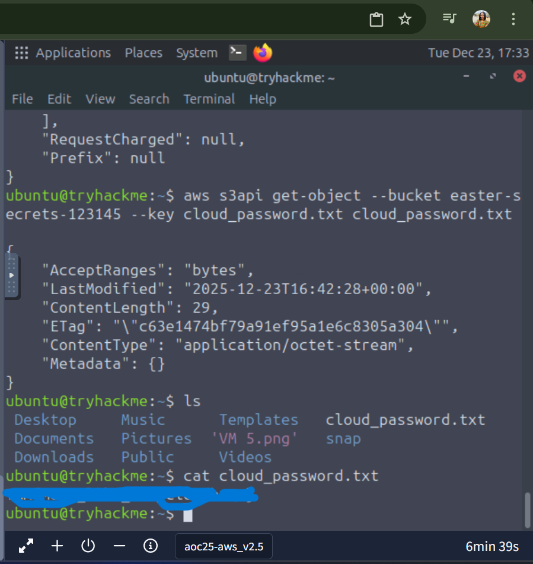
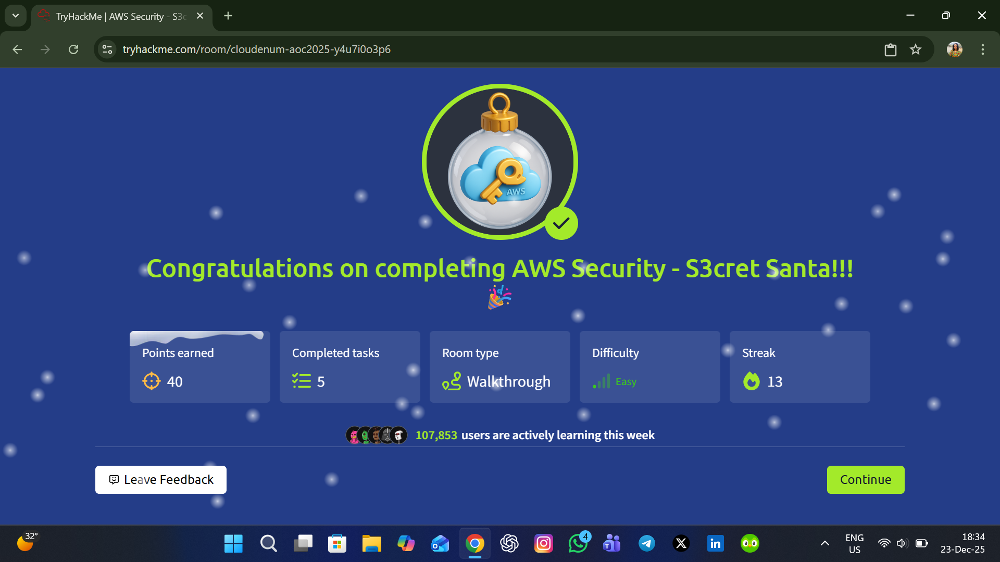

## Advent of Cyber 2025 – Day 23: AWS Security – S3cret Santa 🎄☁️

I just completed **Day 23** of the Advent of Cyber 2025, diving into **AWS Security and Enumeration**. This lab gave me hands-on experience with **IAM, roles, and S3 buckets**, and it was a fantastic way to connect theoretical knowledge with practical cloud security skills.

## Task 1: Introduction

The lab began with a scenario where an elf discovered AWS credentials on Sir Carrotbane’s desktop. I configured the **AWS CLI** to explore the cloud environment and learned how to verify credentials using:  Command 👇

- aws sts get-caller-identity

This task taught me the importance of credential security and how AWS CLI can be used to interact programmatically with cloud accounts. Seeing account numbers, ARNs, and user details in action made the cloud feel more tangible.

## Task 2: IAM – Users, Roles, Groups, and Policies

Next, I explored AWS IAM fundamentals:

Users: Individual identities with credentials.

Groups: Collections of users for easier permission management.

Roles: Temporary identities for elevated access.

Policies: JSON documents defining actions and resources.

I also learned why misconfigurations can expose sensitive data and how least privilege principles help secure AWS environments. This was a key moment where I connected IAM theory with real-world security practices.

## Task 3: Practical – Enumerating a User’s Permissions

I then practiced enumerating users and their permissions using AWS CLI: Commands 👇

- aws iam list-users
- aws iam list-user-policies --user-name <username>
- aws iam list-attached-user-policies --user-name <username>
- aws iam list-groups-for-user --user-name <username>

This task gave me a clear picture of how permissions are structured in a real AWS account. I got to see inline vs. attached policies and understand what actions users are allowed to perform. It was exciting to explore IAM entities from a security perspective.

## Task 4: Assuming Roles

The next step was assuming roles to gain temporary elevated permissions. Using AWS STS, I generated temporary credentials and set them in my environment: Command 👇

- aws sts assume-role --role-arn <role-arn> --role-session-name <session-name>

This task highlighted how roles safely elevate access without sharing permanent credentials. It gave me practical insight into how roles are used in real-world AWS environments for operational security.

## Task 5: Exploring S3

Finally, I applied my permissions to explore Amazon S3, AWS’s object storage service. I practiced listing buckets and their contents: Command 👇

- aws s3api list-buckets
- aws s3api list-objects --bucket <bucket-name>

I learned how buckets organize files, how permissions affect access, and gained practical experience in cloud storage security. This task connected all the previous lessons and showed how IAM policies directly impact access to sensitive data.

Key Takeaways

- Configured and used AWS CLI effectively

- Understood IAM users, groups, roles, and policies

- Practiced assuming roles with temporary credentials

- Explored S3 buckets and objects safely

- Learned the importance of least privilege and secure credential management

This lab was an incredible introduction to AWS security, connecting IAM concepts, role-based access, and cloud storage in a real-world scenario. I now feel much more confident navigating and securing AWS environments.
### Screenshot – AWS CLI Enumeration

### Screenshot – Completion

