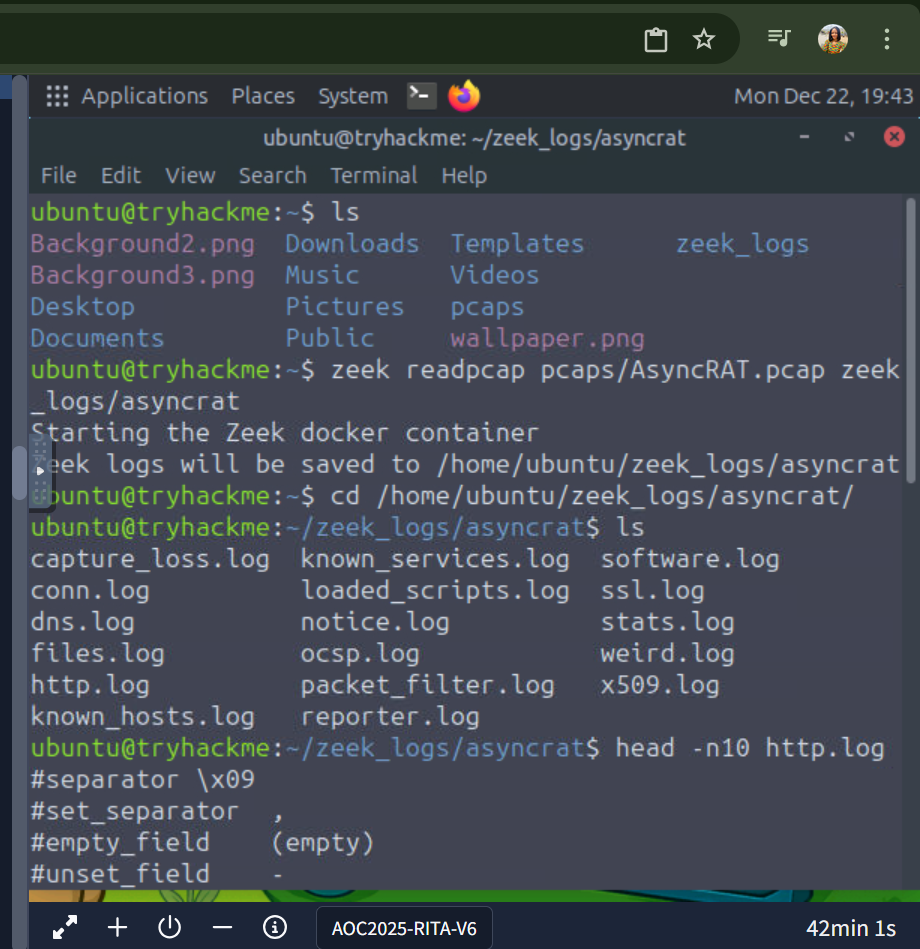

# TryHackMe – Advent of Cyber 2025  
## Day 22: C2 Detection – Command & Carol

## What This Lab Was About
In this lab, I learned how security analysts detect Command and Control (C2) activity by analyzing network traffic.

## Tools Used
- TryHackMe Virtual Machine
- Zeek
- RITA
- PCAP files

## What I Practiced
- Converting PCAP files into Zeek logs
- Importing Zeek logs into RITA
- Identifying suspicious network behavior

## Key Things I Learned
- C2 traffic often follows patterns
- Metadata can reveal malicious activity
- Network monitoring tools are important for SOC analysts

### Screenshot – CLI Enumeration

### Screenshot – Completion

